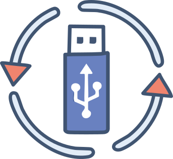
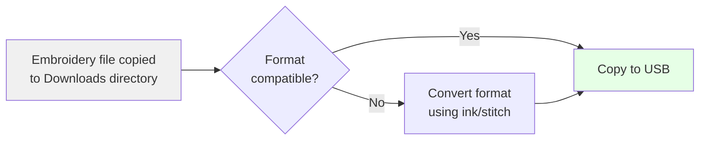
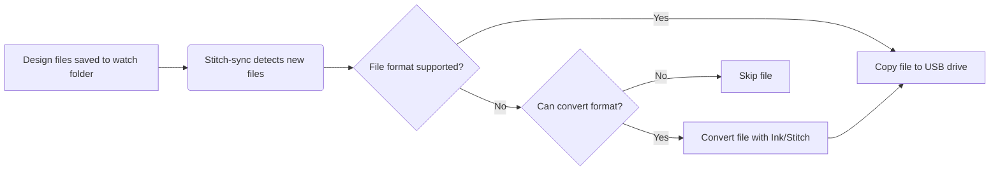

# Stitch-sync Embroidery File Sync
[](https://github.com/osteele/stitchsync/actions/workflows/crossplatform-test.yml)
[](https://github.com/osteele/stitch-sync/releases)
[](LICENSE)
[]()



**Stitch-sync** is an automated directory watcher and embroidery file converter.


It watches for design files in a specified directory, and copies them to a
connected USB drive.

It can also convert files to the correct format for your embroidery machine. For
example, it can convert a DST file from [TurtleStitch] to a JEF file for Janome
embroidery machines.



[View on GitHub](https://github.com/osteele/stitch-sync)

## Features
- Automatically monitors directories for new embroidery design files.
    - The default directory is the user's Downloads directory. Other
      directories can be specified with the `--dir` option.
- Converts designs to formats compatible with your embroidery machine
- Supports any machine format that Ink/Stitch can export
- Copies converted files to a USB drive
- Sanitizes output filenames for better compatibility. For example, it removes
  spaces and underscores, since some machines do not recognize files with these
  names.
    - To do: Only do this if the machine requires it
- Copies converted files to a subdirectory, for example `EMB/Embf`, for
  machines that require this
- Database of embroidery machines and their supported formats
- Cross-platform support (macOS, Windows, Linux) (work in progress)

## Installation

### From precompiled binaries

Run this in the terminal to install the latest version:

macOS/Linux:

```bash
/bin/bash -c "$(curl -fsSL https://raw.githubusercontent.com/osteele/stitchsync/refs/heads/main/scripts/install.sh)"
```

Windows:

```powershell
irm https://raw.githubusercontent.com/osteele/stitchsync/main/scripts/install.ps1 | iex
```

Note: The Windows install script has not yet been tested. As a fallback, you can
install [Cygwin][] and then run the macOS/Linux instructions from the Cygwin
terminal.

[Cygwin]: https://www.cygwin.com/

Only if you use the **conversion feature** (e.g. to convert say DST files to JEF
files), you need to install:

1. [Inkscape][Inkscape] must be installed on your system
2. The [ink/stitch extension][inkstitch] must be installed


### From source

1. Install [Rust][]
2. Clone the repository
3. Build and install

[Rust]: https://www.rust-lang.org/

```bash
# Clone the repository
git clone https://github.com/osteele/stitch-sync
cd stitch-sync

# Build and install
cargo install --path .
```

## Basic Usage

Watch the Downloads directory for new embroidery files, and copy them to a USB drive:

```bash
stitch-sync
```

Watch a directory other than the Downloads directory:

```bash
stitch-sync watch --dir /path/to/directory
```

## Additional Features

By default, stitch-sync copies DST files (the industry standard format) to a USB drive. You only need to specify a machine if:
- Your machine doesn't accept DST files (e.g., Janome machines that require JEF format)
- Your machine needs files in a specific directory (e.g., `EMB/Embf`)
- Your machine has special filename requirements

If you do need to specify a machine, you can do it for just the current session:

```bash
stitch-sync watch --machine "Janome MC9900"
```

Or set it as the default for future sessions:

```bash
stitch-sync set machine "Janome MC9900" # Set default machine
stitch-sync # Use default machine
```

Select a different output format from the default (DST):

```bash
stitch-sync watch --output-format jef
```

List all supported machines:

```bash
stitch-sync machines
```

List machines that support a specific format:

```bash
stitch-sync machines --format dst
```

List all supported file formats:

```bash
stitch-sync formats
```

Show detailed information for a specific machine:

```bash
stitch-sync machine info "Brother PE800"
```

View help:

```bash
stitch-sync --help
```

Example output:

```bash
# List file formats
$ stitch-sync formats
dst: Tajima -- Industry standard format, widely supported
exp: Melco Expanded
jef: Janome Embroidery Format
jef+: Janome Embroidery Format Plus -- Enhanced version of JEF with additional features
pes: Brother Embroidery Format
vip: Viking/Pfaff -- Legacy format
vp3: Viking/Pfaff Phase 3 -- Current format for Viking and Pfaff machines
xxx: Singer
...

# List all machines
$ stitch-sync machines
Brother PE800 (formats: pes)
Janome MC9900 (formats: jef, dst)
Pfaff Creative 4 (formats: vp3)
...
```

## How It Works



1. The program watches the specified directory for new embroidery files
2. When a new file is detected:
   - Checks if the file format is acceptable based on settings:
     - With `--machine`: Accepts formats supported by the specified machine
     - With `--output-format`: Accepts formats that can be converted
     - Default: Accepts only DST files
   - For compatible formats: Copies directly to EMB directory
   - For other formats: Converts using Inkscape with ink/stitch
   - Sanitizes the output filename (removes spaces/underscores)
   - If a USB drive with an EMB/Embf directory is found:
     - Copies converted and/or compatible files there
3. Press 'q' to quit the program

## Supported Platforms

- macOS:
    - Looks for Inkscape in PATH and `/Applications/Inkscape.app`
    - Checks `/Volumes` for USB drives
- Windows:
    - Looks for Inkscape in PATH and Program Files
    - Checks all drive letters for USB drives
    - **Note:** Minimally tested, USB drive detection is experimental
- Linux:
    - Looks for Inkscape in PATH and common installation directories
    - Checks `/media/<username>` for USB drives
    - **Note:** Minimally tested, USB drive detection is experimental

## Known Limitations

- The list of supported embroidery machines and formats is currently minimal and may contain errors or omissions. Please report any issues or submit pull requests to improve the machine database.
- USB drive detection and file copying has not been thoroughly tested on Windows and Linux platforms. Use with caution and verify the results. Feedback and contributions to improve cross-platform support are welcome.

## Contributing

Contributions are welcome! Developer documentation is available in the [docs/] directory.
Please feel free to submit a Pull Request.

[docs/]: https://github.com/osteele/stitch-sync/tree/main/docs

## Acknowledgments

- [Inkscape][inkscape] - Vector graphics software
- [ink/stitch][inkstitch] - Embroidery extension for Inkscape

[inkscape]: https://inkscape.org/
[inkstitch]: https://inkstitch.org/
[inkscape-mac]: https://inkscape.org/release/1.4/mac-os-x/
[inkscape-win]: https://inkscape.org/release/1.4/windows/
[inkscape-linux]: https://inkscape.org/release/1.4/linux/
[inkstitch-install]: https://inkstitch.org/docs/install/
[TurtleStitch]: https://turtlestitch.com/

## License

This project is licensed under the MIT License - see the LICENSE file for details.
