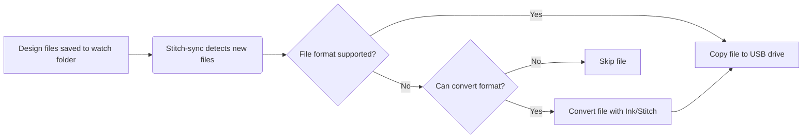

# Stitch-sync
[](https://github.com/osteele/stitchsync/actions/workflows/crossplatform-test.yml)

An automated embroidery file converter that watches for design files and
prepares them for your embroidery machine.

It uses the [ink/stitch extension][inkstitch] for [Inkscape] to convert files to
a format supported by the specified embroidery machine, and copies design files
to a connected USB drive.

## Features
- Automatically monitors directories for new embroidery design files
- Converts designs to formats compatible with your embroidery machine
- Supports any machine format that Ink/Stitch can export
- Copies converted files to an EMB/Embf directory (e.g., on a USB drive)
- Database of embroidery machines and their supported formats
- Cross-platform support (macOS, Windows, Linux)
- Sanitizes output filenames for better compatibility

## Prerequisites

1. [Inkscape][Inkscape] must be installed on your system
2. The [ink/stitch extension][inkstitch] must be installed

## Installation

### From precompiled binaries

Run this in the terminal to install the latest version:

```bash
/bin/bash -c "$(curl -fsSL https://raw.githubusercontent.com/osteele/stitchsync/refs/heads/main/scripts/install.sh)"
```

### From source

```bash
# Clone the repository
git clone https://github.com/osteele/stitch-sync
cd stitch-sync

# Build and install
cargo install --path .
```

## Basic Usage

```bash
stitch-sync
```

Set your embroidery machine
```bash
stitch-sync set machine
```

This is necessary if your embroidery machine requires a different format than
the default (DST), or if it requires the output files to be located in a
specific directory on the USB drive.

## Additonal Examples

Specify a target machine for just the current session, and watch for new
designs:

```bash
stitch-sync watch --machine "Brother PE800"
```

Watch a directory besides the default downloads directory:

```bash
stitch-sync watch --dir /path/to/directory
```

Select a different output format from the default (DST):

```bash
stitch-sync watch --output-format jef
```

List all supported machines:

```bash
stitch-sync machines
```

List machines that support a specific format:

```bash
stitch-sync machines --format dst
```

List all supported file formats:

```bash
stitch-sync formats
```

Show detailed information for a specific machine:

```bash
stitch-sync machine info "Brother PE800"
```

View help:

```bash
stitch-sync --help
```

Example output:

```bash
# List file formats
$ stitch-sync formats
dst: Tajima -- Industry standard format, widely supported
exp: Melco Expanded
jef: Janome Embroidery Format
jef+: Janome Embroidery Format Plus -- Enhanced version of JEF with additional features
pes: Brother Embroidery Format
vip: Viking/Pfaff -- Legacy format
vp3: Viking/Pfaff Phase 3 -- Current format for Viking and Pfaff machines
xxx: Singer
...

# List all machines
$ stitch-sync machines
Brother PE800 (formats: pes)
Janome MC9900 (formats: jef, dst)
Pfaff Creative 4 (formats: vp3)
...
```

## How It Works



1. The program watches the specified directory for new embroidery files
2. When a new file is detected:
   - Checks if the file format is acceptable based on settings:
     - With `--machine`: Accepts formats supported by the specified machine
     - With `--output-format`: Accepts formats that can be converted
     - Default: Accepts only DST files
   - For compatible formats: Copies directly to EMB directory
   - For other formats: Converts using Inkscape with ink/stitch
   - Sanitizes the output filename (removes spaces/underscores)
   - If a USB drive with an EMB/Embf directory is found:
     - Copies converted and/or compatible files there
3. Press 'q' to quit the program

## Configuration

The program supports a configuration file located at:
- Linux/macOS: `~/.config/stitch-sync/config.toml`
- Windows: `%APPDATA%\stitch-sync\config.toml`

Example configuration:
```toml
# Default directory to watch
watch_dir = "/Users/username/Downloads"

# Default machine
machine = "Brother PE800"
```

You can set configuration values using the following commands:

```bash
# Set default watch directory
stitch-sync set watch-dir /path/to/directory

# Set default machine
stitch-sync set machine "Brother PE800"

# Clear a configuration value
stitch-sync config clear watch-dir

# View current configuration
stitch-sync config show
```

## Supported Platforms

- macOS:
  - Looks for Inkscape in PATH and `/Applications/Inkscape.app`
  - Checks `/Volumes` for USB drives
- Windows:
  - Looks for Inkscape in PATH and Program Files
  - Checks all drive letters for USB drives
  - **Note:** Minimally tested, USB drive detection is experimental
- Linux:
  - Looks for Inkscape in PATH and common installation directories
  - Checks `/media/<username>` for USB drives
  - **Note:** Minimally tested, USB drive detection is experimental

## Known Limitations

- The list of supported embroidery machines and formats is currently minimal and may contain errors or omissions. Please report any issues or submit pull requests to improve the machine database.
- USB drive detection and file copying has not been thoroughly tested on Windows and Linux platforms. Use with caution and verify the results. Feedback and contributions to improve cross-platform support are welcome.

## Troubleshooting

### Inkscape Not Found

Make sure Inkscape is installed and accessible. Download from:
- macOS: [Inkscape for macOS][inkscape-mac]
- Windows: [Inkscape for Windows][inkscape-win]
- Linux: Use your package manager or [Inkscape for Linux][inkscape-linux]

### ink/stitch Extension Not Found

1. Download the [ink/stitch extension][inkstitch-install]
2. Follow the installation instructions for your platform
3. Restart Inkscape after installation

### Conversion Errors

1. Ensure your DST file is valid
2. Check that ink/stitch is properly installed
3. Try converting the file manually in Inkscape to verify it works

## Contributing

Contributions are welcome! Please feel free to submit a Pull Request.

## Acknowledgments

- [Inkscape][inkscape] - Vector graphics software
- [ink/stitch][inkstitch] - Embroidery extension for Inkscape

[inkscape]: https://inkscape.org/
[inkstitch]: https://inkstitch.org/
[inkscape-mac]: https://inkscape.org/release/1.4/mac-os-x/
[inkscape-win]: https://inkscape.org/release/1.4/windows/
[inkscape-linux]: https://inkscape.org/release/1.4/linux/
[inkstitch-install]: https://inkstitch.org/docs/install/

## License

This project is licensed under the MIT License - see the LICENSE file for details.
