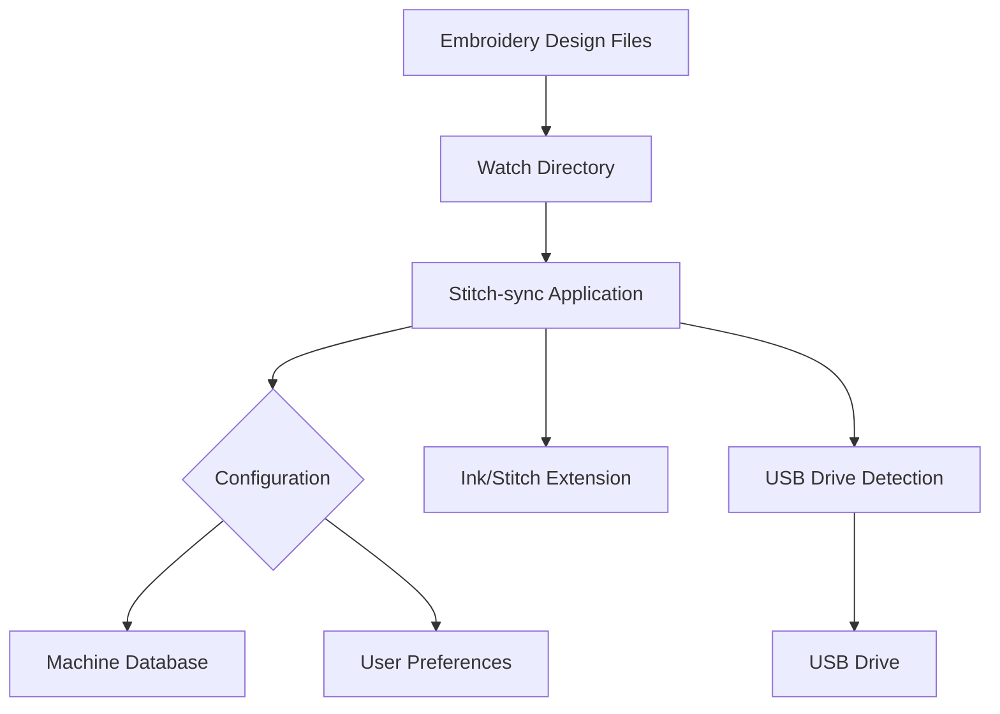

# Developer Notes

This document contains technical information and guidelines for developers working on the Stitch-sync project, which is implemented in Rust.

## High-Level Design



## Technology Stack

Stitch-sync is built using the following technologies:

- **Rust**: The core application logic is implemented in Rust, chosen for its performance, safety, and cross-platform support.
- **Inkscape with ink/stitch**: Used for converting embroidery file formats.
- **CLI**: The command-line interface is built using the `clap` crate.
- **Config**: Configuration management uses the `serde` and `toml` crates.
- **CSV**: The machine database is stored as a CSV file, parsed using the `csv` crate.
- **Logging**: Logging is handled by the `log` and `env_logger` crates.
- **Error Handling**: Errors are managed using the `anyhow` and `thiserror` crates.
- **File System**: File system interactions use the standard `std::fs` module.
- **OS Integration**: Platform-specific functionality is implemented using conditional compilation and OS-specific crates:
  - **Linux**: `libudev` for USB device detection
  - **macOS**: `core-foundation` and `io-kit-sys` for device management
  - **Windows**: `windows` crate for Win32 API access
- **Concurrency**: Asynchronous operations and thread management use the `tokio` and `crossbeam` crates.
- **Testing**: Unit and integration tests are written using the built-in Rust testing framework.

## Project Structure

```text
stitch-sync/
├── src/
│   ├── main.rs           # Application entry point
│   ├── cli/              # Command-line interface modules
│   ├── config/           # Configuration handling
│   ├── conversion/       # File conversion logic
│   ├── machine/          # Embroidery machine definitions
│   └── watcher/          # File system monitoring
├── tests/                # Integration tests
├── docs/                 # Documentation
└── resources/            # Static resources (machine data, etc.)
```

## Development Setup

1. Install development dependencies:
   - Rust and Cargo (latest stable)
   - Inkscape with ink/stitch extension
   - (Linux only) libudev-dev: `sudo apt-get install libudev-dev`

2. Clone and build:
   ```bash
   git clone https://github.com/osteele/stitch-sync
   cd stitch-sync
   cargo build
   ```

3. Run tests:
   ```bash
   cargo test
   ```

## Cross-Platform Development

The project uses conditional compilation for platform-specific code:

```rust
#[cfg(target_os = "macos")]
fn get_usb_drives() -> Vec<Path> {
    // macOS-specific implementation
}

#[cfg(target_os = "windows")]
fn get_usb_drives() -> Vec<Path> {
    // Windows-specific implementation
}

#[cfg(target_os = "linux")]
fn get_usb_drives() -> Vec<Path> {
    // Linux-specific implementation
}
```

### Platform-Specific Dependencies

- **Linux**: Uses `libudev` for USB device detection
- **macOS**: Uses `core-foundation` and `io-kit-sys` for device management
- **Windows**: Uses the `windows` crate for Win32 API access

## Testing

### Unit Tests

Write unit tests in the same file as the code being tested:

```rust
#[cfg(test)]
mod tests {
    use super::*;

    #[test]
    fn test_feature() {
        // Test implementation
    }
}
```

### Integration Tests

Place integration tests in the `tests/` directory. These tests verify the interaction between multiple components.

### Cross-Platform Testing

The project uses GitHub Actions to test on multiple platforms:
- Ubuntu Latest
- Windows Latest
- macOS Latest

See `.github/workflows/crossplatform-test.yml` for the CI configuration.

## Code Style

- Follow the Rust standard formatting (`cargo fmt`)
- Use `cargo clippy` for linting
- Prefer functional programming patterns where appropriate

## Error Handling

- Use `anyhow::Result` for error propagation
- Create custom errors when needed using `thiserror`
- Provide meaningful error messages for user-facing errors
