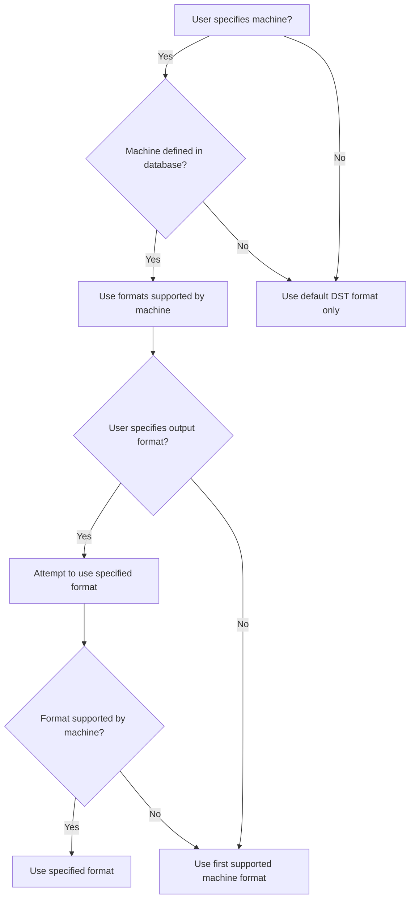
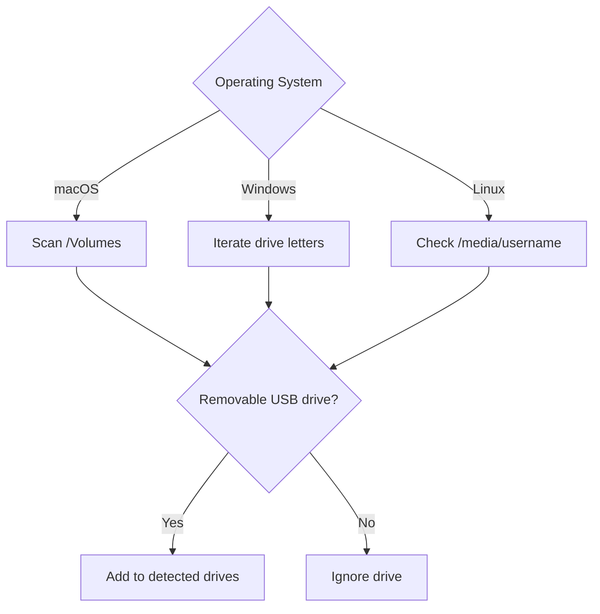
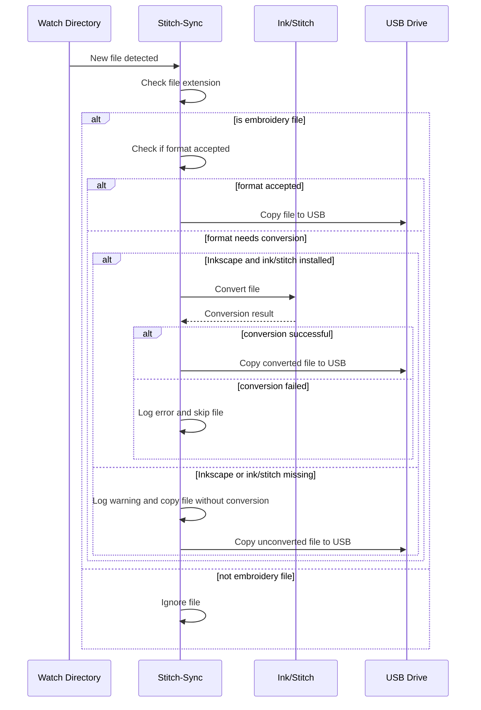

# Stitch-sync Specification

This document describes how the stitch-sync application determines which file formats to support, where to watch for design files, where to copy converted files, and how it handles design files in various scenarios.

- [Configuration Management](#configuration-management)
- [Format Selection and Machine Compatibility](#format-selection-and-machine-compatibility)
  - [Command Line Options](#command-line-options)
  - [Determining Supported File Formats](#determining-supported-file-formats)
    - [Default Behavior (No Options)](#default-behavior-no-options)
    - [With `--machine` Specified](#with---machine-specified)
    - [With `--output-format` Specified](#with---output-format-specified)
    - [With Both Options](#with-both-options)
  - [Acceptable Formats](#acceptable-formats)
- [Determining Watch Location](#determining-watch-location)
- [Detecting USB Drives](#detecting-usb-drives)
  - [macOS](#macos)
  - [Windows](#windows)
  - [Linux](#linux)
- [Determining USB Drive Location](#determining-usb-drive-location)
- [Handling Design Files](#handling-design-files)
- [Inkscape and ink/stitch Integration](#inkscape-and-inkstitch-integration)
- [Command Line Interface](#command-line-interface)
  - [Commands](#commands)
  - [`homepage` Command](#homepage-command)

## Configuration Management

Configuration is handled through:
1. Command-line arguments (highest priority)
2. Environment variables
3. Configuration file (lowest priority)

The configuration file uses TOML format and is located at:
- Linux/macOS: `~/.config/stitch-sync/config.toml`
- Windows: `%APPDATA%\stitch-sync\config.toml`

## Format Selection and Machine Compatibility

Stitch-sync can operate in two modes:
- Simple format conversion (using `--output-format`)
- Machine-aware conversion (using `--machine`)

### Command Line Options

- `--machine` / `-m`: Specify target embroidery machine
- `--output-format` / `-o`: Specify desired output format
- Both options are optional and can be used together

### Determining Supported File Formats

#### Default Behavior (No Options)
- Accepts DST files
- Converts to DST format
- Copies only converted files to USB directory

#### With `--machine` Specified
- Accepts all formats supported by the specified machine
- Uses machine's primary format as preferred output format
- Copies both converted files and already-compatible files to USB directory

#### With `--output-format` Specified
- Accepts only input files that can be converted to specified format
- Converts all files to specified format
- Copies only converted files to USB directory

#### With Both Options
- Accepts all formats supported by the specified machine
- Uses specified output format instead of machine's default
- Copies both converted files and already-compatible files to USB directory

### Acceptable Formats
- With `--machine`: All formats listed in machine's specifications
- Without `--machine`: Only DST

Stitch-sync will convert design files to the preferred output format if possible. If a design cannot be converted to the preferred format, but the machine supports other formats, stitch-sync will convert it to one of the other supported formats instead.

## Determining Watch Location

Stitch-sync determines which directory to watch for new design files based on:

1. The directory specified via the CLI `--dir` option
2. The `watch-dir` value in the config file
3. The default Downloads directory

The precedence is: CLI option > config file > default Downloads directory.

## Detecting USB Drives

Stitch-sync attempts to automatically detect connected USB drives and determine if they contain a compatible directory for copying converted embroidery files.

The process for detecting USB drives varies by operating system:

### macOS
- Scans the `/Volumes` directory for mounted drives
- For each drive, checks if it is a removable USB drive by:
  - Running `diskutil info` on the drive path
  - Parsing the output to check for `Removable Media: Yes` and `Protocol: USB`
- If a drive is identified as a USB drive, it is added to the list of detected drives

### Windows
- Iterates through drive letters from A to Z
- For each drive letter, checks if the drive exists and is a removable USB drive using the `GetDriveType` Windows API
- If a drive is identified as a USB drive, it is added to the list of detected drives

### Linux
- Looks for mounted drives in `/media/<username>/`
- For each drive, uses the `libudev` library to check if it is a USB device by:
  - Creating a `libudev` context and enumerator
  - Matching devices with the `usb` subsystem
  - Comparing the device path to the canonicalized drive path
  - Checking if the device has a parent device with the `usb` subsystem
- If a drive is identified as a USB drive, it is added to the list of detected drives

## Determining USB Drive Location

If a machine is specified and it has a `usb_path` property defined in the machine database, stitch-sync will look for that path on any detected USB drives and copy converted files there if found.

If no specific path is configured for the machine, stitch-sync will use the top-level directory on the USB drives.

If no matching USB drive or directory is found, stitch-sync will just convert files in-place without copying.

## Handling Design Files

When a new file is detected in the watched directory, stitch-sync does the following:

1. Determines if the file extension is an embroidery design format (e.g. DST, PES, JEF, etc.)
   - If not, the file is ignored
2. Checks if the file format is accepted based on the specified machine and/or output format settings
   - If the file is in an accepted format, it is copied as-is to the USB drive location
   - If the file is not in an accepted format:
     - If Inkscape and ink/stitch are installed, stitch-sync attempts to convert it to the preferred output format
     - If Inkscape or ink/stitch are missing, a warning is logged and the file is copied without conversion
3. If conversion is attempted and successful, the converted file is copied to the USB drive location
   - The copied file's name is sanitized to ensure better compatibility
4. If conversion fails, an error is logged and the file is skipped

Stitch-sync continuously monitors the watched directory for new files and processes them as they appear. The user can press 'q' at any time to gracefully quit the application.

## Inkscape and ink/stitch Integration

While stitch-sync relies on Inkscape and the ink/stitch extension for file format conversion, they are not strictly required for the application to run.

If Inkscape is not found on the system when starting the `watch` command, stitch-sync will print a warning message indicating that files will be copied to USB drives without conversion. It will then continue to monitor the watch directory and copy any compatible embroidery files to the target USB drive, skipping the conversion step.

Similarly, if Inkscape is installed but the ink/stitch extension is missing, a warning will be printed but the application will continue to run, copying files without conversion.

This allows users to still utilize stitch-sync for automating the transfer of embroidery files to their machines, even if they don't have Inkscape set up for file conversion. However, for the full functionality of automatic format conversion, both Inkscape and ink/stitch should be installed.
