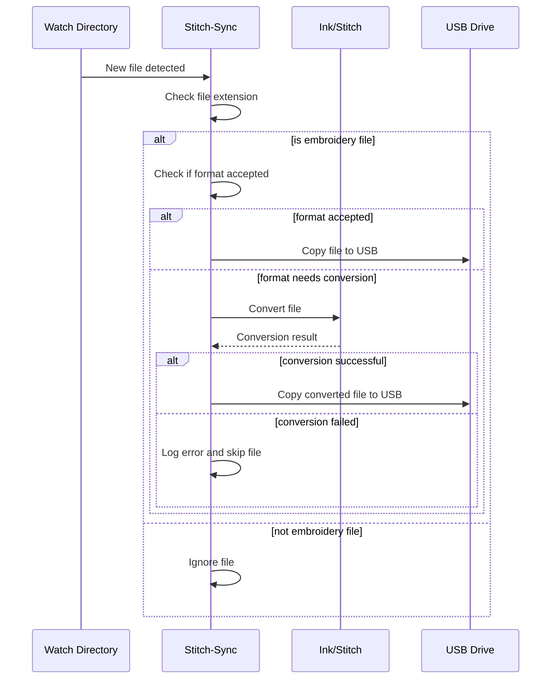

# Stitch-sync Specification

This document describes how the stitch-sync application determines which file formats to support, where to watch for design files, where to copy converted files, and how it handles design files in various scenarios.

## Determining Supported File Formats

Stitch-sync determines the file formats to support based on:

1. The embroidery machine specified by the user
   - If a machine is specified via the CLI `--machine` option or `stitch-sync set machine` command, stitch-sync will accept the file formats supported by that machine, as defined in the machine database.
   - If no machine is specified, stitch-sync will only accept DST files by default.

2. The output format specified by the user
   - If an output format is explicitly specified via the CLI `--output-format` option, stitch-sync will attempt to convert design files to that format, regardless of the selected machine's supported formats.
   - If no output format is specified, stitch-sync will use the first supported format listed for the selected machine, or DST if no machine is selected.

Stitch-sync will convert design files to the preferred output format if possible. If a design cannot be converted to the preferred format, but the machine supports other formats, stitch-sync will convert it to one of the other supported formats instead.

## Determining Watch Location

Stitch-sync determines which directory to watch for new design files based on:

1. The directory specified via the CLI `--dir` option
2. The `watch-dir` value in the config file
3. The default Downloads directory

The precedence is: CLI option > config file > default Downloads directory.

## Detecting USB Drives

Stitch-sync attempts to automatically detect connected USB drives and determine if they contain a compatible directory for copying converted embroidery files.

The process for detecting USB drives varies by operating system:

### macOS
- Scans the `/Volumes` directory for mounted drives
- For each drive, checks if it is a removable USB drive by:
  - Running `diskutil info` on the drive path
  - Parsing the output to check for `Removable Media: Yes` and `Protocol: USB`
- If a drive is identified as a USB drive, it is added to the list of detected drives

### Windows
- Iterates through drive letters from A to Z
- For each drive letter, checks if the drive exists and is a removable USB drive using the `GetDriveType` Windows API
- If a drive is identified as a USB drive, it is added to the list of detected drives

### Linux
- Looks for mounted drives in `/media/<username>/`
- For each drive, uses the `libudev` library to check if it is a USB device by:
  - Creating a `libudev` context and enumerator
  - Matching devices with the `usb` subsystem
  - Comparing the device path to the canonicalized drive path
  - Checking if the device has a parent device with the `usb` subsystem
- If a drive is identified as a USB drive, it is added to the list of detected drives

## Determining USB Drive Location

If a machine is specified and it has a `usb_path` property defined in the machine database, stitch-sync will look for that path on any detected USB drives and copy converted files there if found.

If no specific path is configured for the machine, stitch-sync will use the top-level directory on the USB drives.

If no matching USB drive or directory is found, stitch-sync will just convert files in-place without copying.

## Handling Design Files

When a new file is detected in the watched directory, stitch-sync does the following:

1. Determines if the file extension is an embroidery design format (e.g. DST, PES, JEF, etc.)
   - If not, the file is ignored
2. Checks if the file format is accepted based on the specified machine and/or output format settings
   - If the file is in an accepted format, it is copied as-is to the USB drive location
   - If the file is not in an accepted format, stitch-sync attempts to convert it to the preferred output format using Ink/Stitch
3. If conversion is successful, the converted file is copied to the USB drive location
   - The copied file's name is sanitized to ensure better compatibility
4. If conversion fails, an error is logged and the file is skipped

Stitch-sync continuously monitors the watched directory for new files and processes them as they appear. The user can press 'q' at any time to gracefully quit the application.
